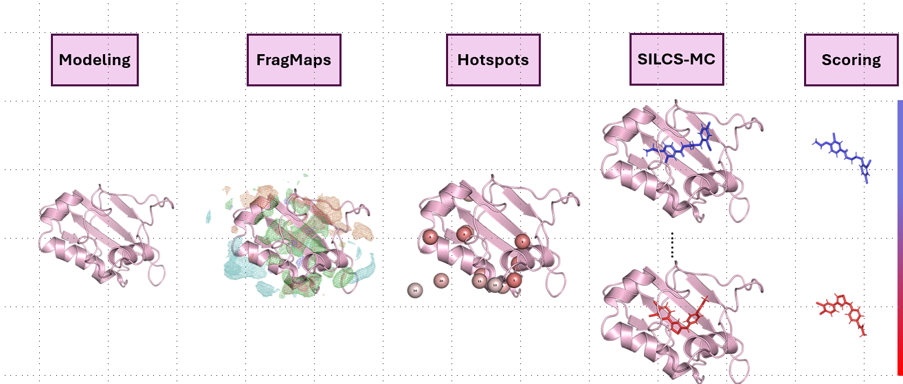

---
hide:
  - navigation
  - feedback
---

# Research

## Membrane Permeability of Small Molecules

Can we predict drug permeability using explainable ML models with a novel feature engineering that is physically intuitive?

We utilize the SILCS platform to generate ligand-free energy profiles, which are then fed into various ML models, ranging from simple regression to neural networks. Instead of the usual SHAP values to identify the parts of molecules that contributed more to prediction, our features tell the whole story.

<figure markdown="span">
  
</figure>

We are now expanding this to cyclic peptides and other complex molecules.
(2024-Present)

___

## Optimizing Lead Drug Candidates for Anxiety

<figure markdown="span">
  
</figure>

Along with a team of medicinal chemists that spans multiple universities, we investigate both computationally and experimentally the Structure Activity Relationships (SAR) and ADMET properties to optimize a SCP2 inhibitor. I led the computational and data management efforts for this project.

(2024-Present)
___

## Phase Separating Lipid Bilayers: Free Energy Landscape

<figure markdown="span">
  
</figure>

Phase-separating ternary lipid bilayer systems are a nightmare for standard all-atom Molecular Dynamics (MD) investigation due to (1) their slow kinetics and (2) energy barriers that causing low to no state transitions, essentially making them rare events from a simulation standpoint. We used Coarse-Grained Simulations with enhanced sampling using Weighted Ensemble (WESTPA) to lay out the underlying thermodynamic landscape of lipid phase separation. We take this a step further by testing the system size effects of this protocol.

(2019-2024)
___

## Lipid Nano-Particles (LNPs) and RNA interactions

<figure markdown="span">
  
</figure>

Internship at Moderna over 2 summers in 2022 and 2023 to help them investigate RNA-Lipid interactions to optimize their LNP formulation. This work was presented at the Biophysical Society Meeting 2024, Philadelphia, PA & GRC Biotherapeutics and Vaccines Development Meeting 2024.

(2022-2023)

___

## Getting Femtosecond Dynamics of Rhodopsin Photoactivation

<figure markdown="span">
  
</figure>

I teamed up with Leslie, a senior graduate student in Grossfield Lab, to develop analysis schemes to track and visualize ultrafast dynamics of Rhodopsin upon light activation to interpret the XFEL experiments.

(2018-2019)

___
