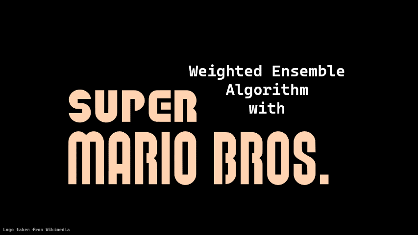
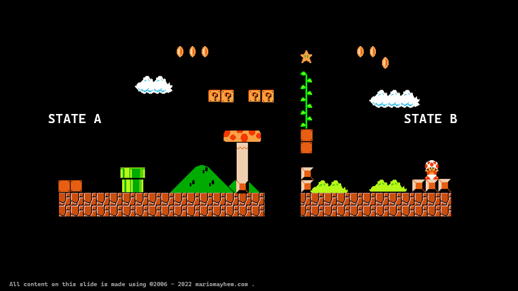
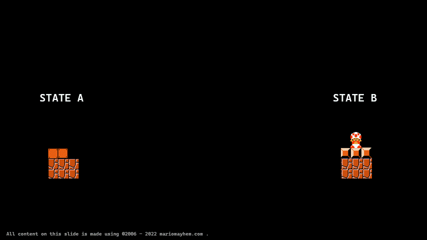
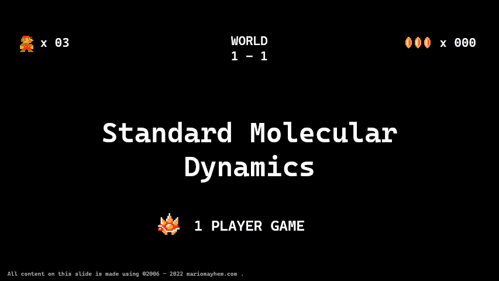
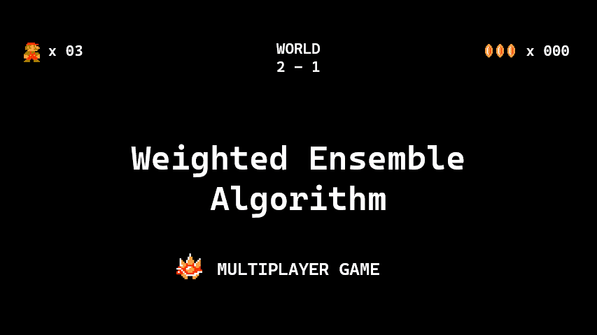

# Weighted Ensemble Approach

The weighted ensemble (WE) strategy, as an enhanced sampling technique, has been very close to my heart. Here is a brief fun explanation of WE.

<!-- more -->

Imagine the configurational space of a system you want to explore is like Mario world.

A lot of cool features (configs), and ideally, you want to capture all of them to get a more complete statistical understanding.

In most cases, you know about states A and B of the system and are interested in the transition between these states.

Ex: You have a protein in open and closed conformations and want to know how it happens.

If you contact a simulation person, they will suggest Molecular Dynamics (MD). 

You can consider the standard MD as a single-player Mario game🎮

Here, the Mario, a single-long MD trajectory, starts from state A and explores the local configs.

Because of some barrier 🚧, Mario may not reach state B. Making this a rare event in the simulation time scale.

Sometimes, Mario is lucky and reaches state B just ONCE.

<video controls autoplay muted loop playsinline style="max-width: 100%; height: auto;">
  <source src="../../media/wemd_intro/5.mp4" type="video/mp4">
</video>

Now if you plot the probability distribution of Mario in Mario World, you get different results depending on where Mario started.

And most of the time, this does not agree with our intuition/experimental data🧪because our Mario has yet to explore the entire Mario world.

<video controls autoplay muted loop playsinline style="max-width: 100%; height: auto;">
  <source src="../../media/wemd_intro/6.mp4" type="video/mp4">
</video>

Our barrier estimation is likely erroneous since Mario jumped over it just once after running  💻 for months

(We need to roll the die 🎲multiple times to get an average value - not once)

So, we need a method that facilitates multiple jumps back and forth between states

Now, enter the Weighted Ensemble!

A multiplayer game🎮🎮🎮🎮!

First, we bin the Mario world🗑️🗑️🗑️🗑️. 

The idea is to let multiple Marios explore each bin systematically and efficiently.

<video controls autoplay muted loop playsinline style="max-width: 100%; height: auto;">
  <source src="../../media/wemd_intro/8.mp4" type="video/mp4">
</video>

But we have a few design choices to make🤔 

How many Marios can I afford to explore a bin?

If you are a broke undergrad student who can afford a laptop, let's say 2 for this explanation.

But the strategy is scalable.

<video controls autoplay muted loop playsinline style="max-width: 100%; height: auto;">
  <source src="../../media/wemd_intro/9.mp4" type="video/mp4">
</video>

Now, we place a Mario in a bin with Probability = 1.

Since we need two Marios per bin, we spawn another Mario and split the parent Mario's Probability to child Marios (0.5 each)

<b>This is the WE stage 🎲.</b>

<video controls autoplay muted loop playsinline style="max-width: 100%; height: auto;">
  <source src="../../media/wemd_intro/10.mp4" type="video/mp4">
</video>

Now we let the Marios run wild (<b>MD stage ⏱️</b>), and as a result, one Mario stays in the old bin, and the other finds a new bin. 

The Marios splits again whenever we have a new or underexplored bin (less than 2 Marios per bin)

<b>(WE stage🎲)</b>

<video controls autoplay muted loop playsinline style="max-width: 100%; height: auto;">
  <source src="../../media/wemd_intro/11.mp4" type="video/mp4">
</video>

Again, we let Mario run wild (<b>MD stage⏱️</b>)

Oops! Now there are three Marios in the second bin - over-exploration! 

Our computers are burning unnecessarily🔥💻🔥!

Thus we merge the Marios in the second bin. 

Meanwhile, we split the Marios in the first bin as it is underexplored. - <b>WE stage</b>

<video controls autoplay muted loop playsinline style="max-width: 100%; height: auto;">
  <source src="../../media/wemd_intro/12.mp4" type="video/mp4">
</video>

Again, we let them roam the World - MD stage.

If we do the WE 🎲and MD⏱️stages alternatively, long enough, we can explore the whole Mario world efficiently!

<video controls autoplay muted loop playsinline style="max-width: 100%; height: auto;">
  <source src="../../media/wemd_intro/13.mp4" type="video/mp4">
</video>

To conclude, here comes a bit of jargon 🧐.

We should have a progress coordinate that you must choose 🚨CAREFULLY🚨 which distinguishes states A and B.

You try to spawn short MD trajectories (Marios, aka walkers) from all over the progress coord space (or from one side if you only have configs from one state).

<video controls autoplay muted loop playsinline style="max-width: 100%; height: auto;">
  <source src="../../media/wemd_intro/14.mp4" type="video/mp4">
</video>

You go through multiple iterations of WE 🎲 + MD⏱️ until you see convergence.

From the converged distribution of walkers, you make a probability distribution, P(x), using the weights of the walkers.

You get the free energy landscape from the P(x) using Stats 101.

<video controls autoplay muted loop playsinline style="max-width: 100%; height: auto;">
  <source src="../../media/wemd_intro/15.mp4" type="video/mp4">
</video>

_____

Endnote:

This was originally posted as [an X (twitter) thread](https://x.com/poruthoor/status/1631815905557479426)

