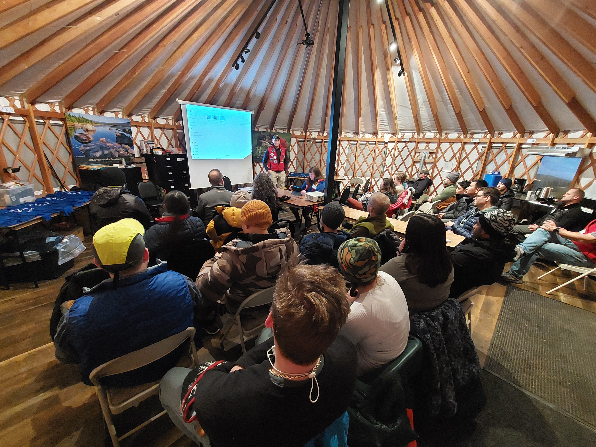
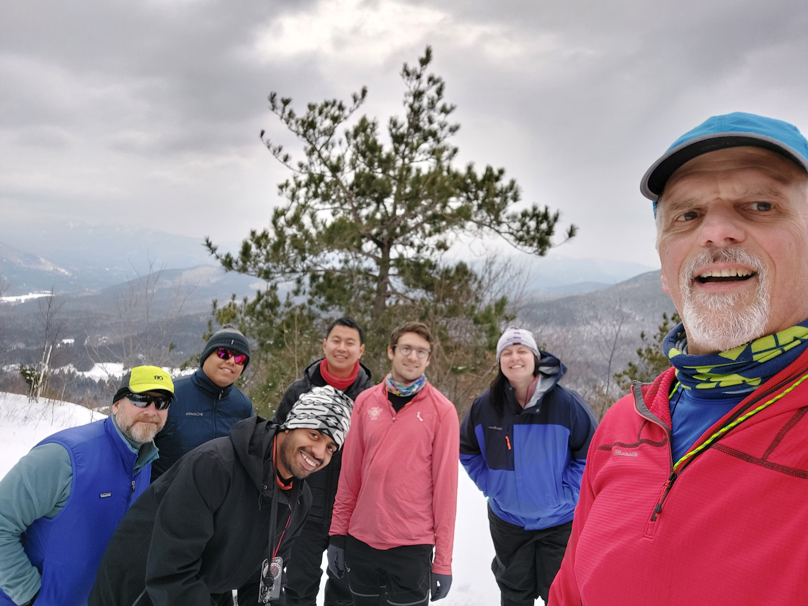
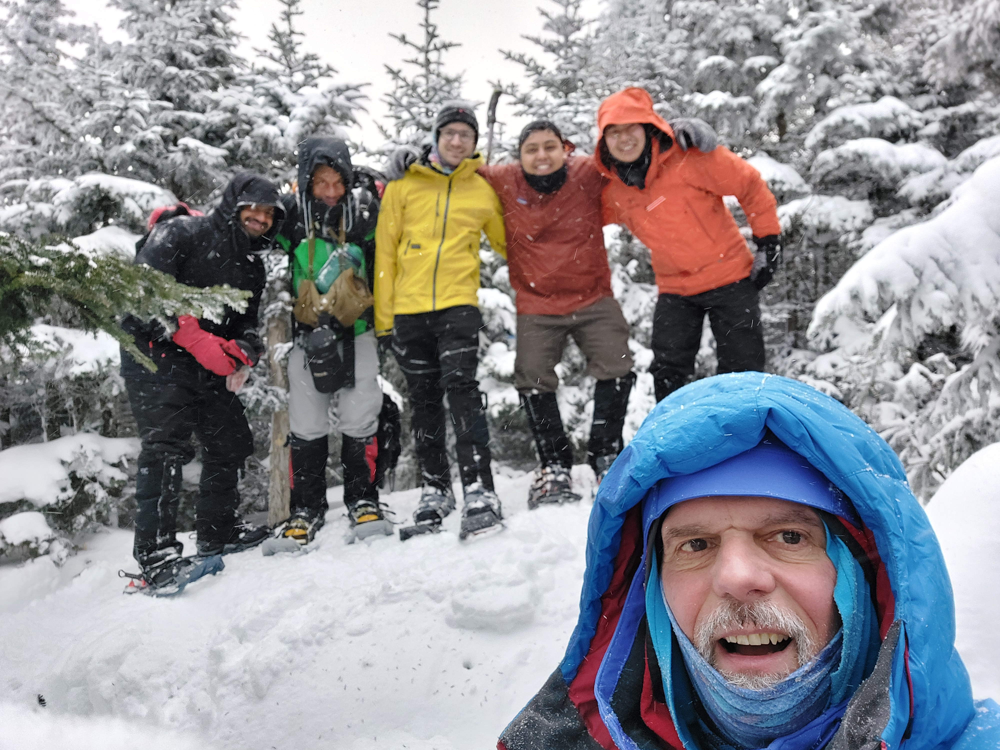

# Winter Mountaineering - Part 2. Take-home messages from the WMS

You might be wondering where is the Part 1 for this. Fear not, I screwed up and did not save the Excel sheet that I maintained for scribbling the gear that I bought with links. Hopefully, later this winter as I retrieve the Winter Gear from the attic, I will remake them with comments that I had after using them (With gear failures and expert advice, they were corrected during the program)

I highly recommend [ADK WMS](https://www.winterschool.org/), if you are into safe winter hiking. It is worth every penny (despite the initial money overhead to invest in your gear - trust me, do not cheap out to save a few bucks, your life might depend on it - Balancing the budget and quality is the key thing). 

Please go through their Student handbook and gear list to prepare. Usually, the application starts in late October or early November. Please follow their Facebook or other social media platforms for this.

The instructors were fantastic, the trip was excellent and I had a 10-star experience.

This write-up is about my experience as an ADK Winter Mountaineering School student in the "Combo section" (Day Hike + Backcountry/Backpacking)

### Day 1  - Check-in and Self-Arrest Training

The day started with the intense gear check. Some of us realized that the microspikes that we bought for crampons were not "the crampons" needed for hard ice navigation. The two-hour break between the gear check and training gave us ample time to go for last-minute shopping to purchase the REAL crampons from Lake Placid. While shopping for an ear buff, I found a nice puffy jacket that was on sale at EMS. I wish I did more shopping here in the valley than online (but there's no guarantee). The local clerks were terrain and weather experts and gave really useful tips. Plus, all of them were extremely nice to us and did not take advantage of our urgency.

If you want to read more about Self-Arrest principles, [American Alpine Club has an amazing article here](https://americanalpineclub.org/news/2023/6/28/snow-climbing).

<figure markdown="span">
  
  <figcaption>Rolling down the hills to self-arrest (Video courtesy: Gary)</figcaption>
</figure>

After the tiring but fun hours of rolling down the hill, we had an amazing dinner prepared by the lovely ADK Loj crew. Then there were two presentations - Winter Mountaineering 101 and Meal Prep.

<figure markdown="span">
  
  <figcaption>Night presentations in the Education Yurt (Photo courtesy: Gary)</figcaption>
</figure>

Here, I will write things about what stuck with me most - this is in no way a comprehensive or exhaustive list of things you should know before starting climbing one fine winter morning - Please do your research and consult experts (I'm just a random dude on the internet - Trust me!)

1. Pick of the ice axe always point towards your pinky to self-arrest.
2. Temperature control: Always make sure we are dry and comfy. Your temperature should dictate your speed - Too sweaty? Loosen up layers and go slow. Too cold? Layer up and go fast. The idea is to have an equilibrium and not to go to extremes.
3. Getting back home is essential, summiting a peak is a bonus.
4. After hiking (This is especially true for back-packing folks): Your meal should be mentally rewarding and you should be looking forward to the warm meal (Don't be like me who regretted bringing Ramen for one of the backpacking nights and crunched half cooked Ramen). Find what gets you excited about food. Try to reflect those in your meal prep. Test your food at least once in your comfy home. If you hate it at home on your couch, chances are you still hate it after a strenuous hike in a cold Lean-to after freezing rain (For example, peanut butter in your oatmeal mix at room temperature might sound delicious, but at -10&deg;F, it tastes and feels like brick).
5. After every hike, ask yourself - What could be improved? Then revise. This is supposed to be fun and not torture.
6. Look out for Lemons - The rule of thumb is having 3 lemons is a sign for the whole party to turn around and come back another time (This was a solid metaphor that came from ADK instructors).

### Day 2 (Shake-down day - To Crows (Big Crow and Little Crow) + More useful talks)

Backward Trip planning: (Assuming you have already done research about the trail that you are aiming for - Including if it is open, weather (not at the trailhead but at the summit too), difficulty, trail conditions, etc)

1. When does the party want to get back to the starting point (Your home, Airbnb, Hotel - Not the trailhead)
2. Check the travel time to the trailhead (back and forth) + Carpooling discussion
3. <b>Set up the turn-around time - This is a golden rule</b>. You always respect the turn-around time even if the summit is 10 feet away. The group needs to discuss the trail navigation (Rule of thumb: 1 mile/hour and an additional 1 hour for every 1000ft elevation gain)
4. Assuming you have individual gear checks already, decide who carries what group gear
5. Fill out the trip form and decide on the meet-up time for the trip.

### Day 3 (Showdown)

The school was divided into different teams based on what they wanted to do that day. There were options for hard/medium/easy hiking, bushwacking, etc. I chose the one for Algonquin since it required going above the tree line and it was supposed to be less than -20&deg;F. For me, the hike up to the treeline was pretty smooth sailing but above the treeline was a shitshow as I wasn't prepared.

#### Note to myself (Things I would have done differently)
1. Instead of the cheap ski goggles, I think Wolf-hood would be the best choice (Need to look into Army supplies).
2. Having a proper Merino wool balaclava is better than the cheap Amazon Balaklava that I bought.
3. All the elastic things including - bag straps that I used to mount the snowshoes/hiking pole, the ski-goggles strap, and the Balaklava - lost their elastic property at low temperatures. I should have gone with clips, wolf-hood, and the wool type instead. My goggles dropped and it fogged up, then my attention was not to summit but to make sure I didn't get frost-bite.
4. Have a dedicated outer section of my backpack just for the above-treeline things.
5. As you roll out close to the summit/before the treeline, add layers aiming for the summit.
6. Track the damn time - I was relying on the group to know the time - I should have been proactive so that I didn't have to frantically put on the gear at the beginning of the treeline stop as we only had 15 minutes to summit and I was chilling in the previous roll-out. Our instructors did warn about this as we were getting closer but I didn't know what he meant by that until I went through it. Lessons were learned.
7. Accessible water is better in the insulated bag inverted (Going for socks is not a good idea as it will get wet)
8. Buying the buff was the best decision ever.
9. Maybe a fannypack?
10. Need to find a setup to get the sortie-pad in and out quickly during the role out.
11. Invest in Avalanche Awareness Programs?

Thankfully, the instructors were super nice and helped me to better pack my stuff for the next time.

<figure markdown="span">
  
   
  <figcaption>Big Crow and Big Slide Teams (Photo courtesy: Gary)</figcaption>
</figure>

Overall , I survived to tell the tale and made friends with folks who may or may not come back! Loved it :heart:
